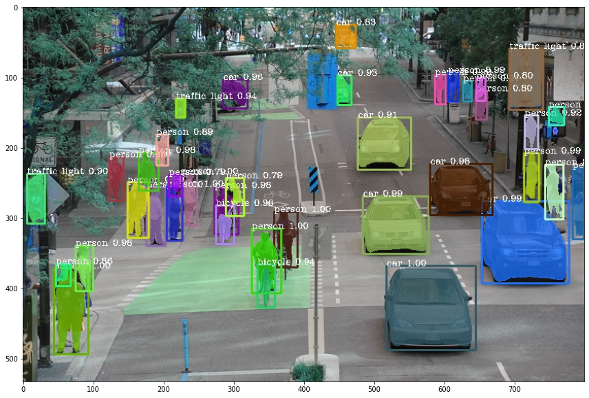

# Object-Detection-and-Image-Segmentation
Object Detection and Image Segmentation with few lines of code using PixelLib library

## Run Code from Colab

[](https://colab.research.google.com/drive/14NJ5Gv76AdUHk5fkcurC8mkC0C5aCAdN?usp=sharing]

## Object Detection

  
  

